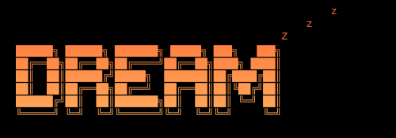

# `DREAM`



**Persistent project memory for Claude Code sessions.**

Dreaming allows animals to consolidate memory and wake up sharper. Claude does the opposite — it hallucinates, loses context, and forgets everything between sessions. That's why I built Dream.

---

## What it does

Dream scans your repository and generates a structured `CLAUDE.md` memory file that loads into every Claude Code session automatically via MCP. Claude instantly understands your stack, architecture, conventions, and current task — without you explaining anything.

It learns your preferences over time. Every correction you give Claude, every pattern you reinforce — Dream records it, weights it by frequency, and injects it as permanent instructions for all future sessions.

When the hallucinations begin, type `/dream`. Claude saves everything, you open a fresh session, and it picks up exactly where you left off — just like sleeping.

---

## Install

```bash
npm install -g dream-mcp
```

**Requires:** Node.js 18+

---

## Quick start

```bash
cd your-project
dream init
```

Run `dream init` once per project. It scans your repo, generates `CLAUDE.md`, and configures the MCP server. The `/dream` slash command is installed globally — it works in every Claude Code session automatically from that point on, no setup needed per project.

**At the end of every session, type `/dream` in Claude Code.** Claude saves everything, you open a fresh session, and it picks up exactly where you left off.

---

## The session loop

```
dream init          → memory generated, /dream command installed
↓
work in Claude Code → Claude reads CLAUDE.md automatically
↓
type /dream         → Claude saves everything: task, changes, preferences, issues
↓
new session         → Claude reads updated CLAUDE.md, already knows where you left off
↓
repeat
```

---

## Commands

### Core

```bash
dream init              # Initialize Dream in this repository
dream scan              # Full rescan — regenerate CLAUDE.md from scratch
dream update            # Incremental update from recent git commits
dream status            # Show memory state, token count, MCP config
dream load              # Print memory to terminal (supports piping)
dream watch             # Background file watcher — auto-updates on change
dream doctor            # Validate full setup, diagnose issues
dream install-command   # Install the /dream slash command into Claude Code
```

### Preferences

```bash
dream preferences list                        # Show all learned preferences
dream preferences set <key> <value> [cat]     # Set a preference manually
dream preferences remove <key>                # Remove a preference
dream preferences learn                       # Auto-detect from codebase + git
dream preferences export                      # Export to .dream/PREFERENCES.md
dream preferences clear                       # Clear all preferences
```

### Obsidian

```bash
dream obsidian connect [vault-path]   # Connect your Obsidian vault
dream obsidian sync                   # Manual sync to vault
dream obsidian status                 # Show integration status
dream obsidian disconnect             # Disconnect vault
```

---

## How memory works

`dream init` generates a `CLAUDE.md` in your project root:

```markdown
# PROJECT
Name: my-app
Purpose: SaaS dashboard for analytics teams
Stage: development

# STACK
Language: TypeScript
Frontend: Next.js (App Router)
Database: PostgreSQL (Prisma)
Auth: Clerk
Styling: Tailwind CSS
Testing: Vitest

# ARCHITECTURE
- Full-stack monorepo
- Prisma ORM
- Service-layer backend structure
- tRPC API layer

# CONVENTIONS
- Named exports only
- Strict TypeScript mode
- @/ path aliases throughout
- Prettier formatting

# CURRENT TASK
Implement streaming AI responses

# OPEN ISSUES
- WebSocket reconnect instability on mobile

# RECENT CHANGES
2026-05-14
- Migrated auth to Clerk
- Added Prisma schema
- Refactored sidebar component

# HOW CLAUDE SHOULD OPERATE
- Preserve existing architecture patterns
- Use Prisma for all database operations
- Prefer Server Components — Client Components only when required
- Maintain strict typing
```

Token target: **≤ 1,500 tokens**. Dream trims automatically by priority if you exceed the budget.

---

## Preference learning

Dream learns how you work. There are two ways preferences accumulate:

**Auto-detection** — on `dream init` and `dream preferences learn`, Dream analyses your codebase:
- Export style (named vs default)
- Comment density
- TypeScript strictness
- Commit message style from git history
- Formatting tools (Prettier, ESLint)

**Claude reports them** — the most powerful mechanism. When you correct Claude mid-session ("stop adding comments", "keep it shorter", "use named exports"), Claude calls `dream_observe_preference` and it's permanently recorded. Every future session inherits it.

Conflicts are resolved by **frequency weighting**: if a preference is observed 5× and a conflicting one 2×, the former wins. The count is always visible.

Preferences are injected directly into `CLAUDE.md` as hardcoded instructions:

```markdown
# CLAUDE PREFERENCES
_Auto-learned from 12 observations. Last updated: 2026-05-14_

## Response Style
- Keep responses concise — under 3 sentences unless asked for detail
- No emoji unless explicitly requested

## Code Style
- Named exports only, never default exports (high)
- No comments unless the WHY is genuinely non-obvious (high)
- Strict TypeScript — never introduce any (high)

## Workflow
- Run typecheck before declaring done (medium)
- Follow existing patterns before introducing new abstractions (medium)
```

---

## Obsidian integration

Connect your vault and Dream automatically keeps a structured note in sync:

```bash
dream obsidian connect
# → scans iCloud, ~/Documents, ~/Desktop for Obsidian vaults
# → lets you confirm, runs initial sync
```

The generated note includes frontmatter compatible with **Dataview**, your full stack as a table, current task as a callout, open issues as checkboxes, and a recent changes timeline. It updates automatically on every `dream scan` or `dream update`.

---

## MCP integration

`dream init` writes a `.mcp.json` to your project root. Claude Code reads this on startup and connects to Dream's MCP server automatically.

```json
{
  "mcpServers": {
    "dream": {
      "type": "stdio",
      "command": "dream",
      "args": ["mcp"]
    }
  }
}
```

**MCP tools available to Claude:**

| Tool | Purpose |
|------|---------|
| `dream_get_context` | Return full project memory |
| `dream_update_task` | Update current task |
| `dream_add_issue` | Add an open issue |
| `dream_resolve_issue` | Remove a resolved issue |
| `dream_log_change` | Append to recent changes |
| `dream_rescan` | Trigger full repository rescan |
| `dream_observe_preference` | Record a learned user preference |
| `dream_get_preferences` | Return all preferences by category |
| `dream_sync_obsidian` | Sync memory to Obsidian vault |

**MCP resources:**

| Resource | Content |
|----------|---------|
| `dream://memory` | Full `CLAUDE.md` as markdown |
| `dream://tasks` | `TASKS.md` content |
| `dream://stack` | Tech stack as JSON |

---

## File watcher

```bash
dream watch
```

Watches `src/`, `app/`, `prisma/`, `package.json`, and other key paths. Debounces 10 seconds after the last change, then classifies what changed (schema, package, API, new feature) and updates only the relevant sections of `CLAUDE.md`. Obsidian syncs automatically if connected.

For automatic updates on every git commit:

```bash
dream init --hooks
```

---

## Project structure

```
.dream/
  config.json       # Dream configuration
  state.json        # Last scan time, file hashes, token count
  preferences.json  # Learned preferences with frequency weights
  PREFERENCES.md    # Human-readable preference export

CLAUDE.md           # Primary memory — loaded every Claude session
TASKS.md            # Task tracking
.mcp.json           # MCP server config for Claude Code
```

---

## Supported stacks

Dream detects out of the box:

**Frontend:** Next.js (App + Pages Router), React, Vue, Nuxt, SvelteKit, Astro, Remix, Angular, Solid.js

**Backend:** Express, Fastify, NestJS, Hono, Koa, Elysia, tRPC

**Database:** Prisma, Drizzle, TypeORM, Mongoose, SQLite, PostgreSQL, MySQL, Redis

**Auth:** Clerk, NextAuth, Supabase, Passport, Lucia, BetterAuth

**Testing:** Vitest, Jest, Playwright, Cypress, Testing Library

**Styling:** Tailwind, MUI, Chakra, Styled Components, Emotion, Radix/shadcn

**Other languages:** Python (FastAPI, Django, Flask), Go, Rust, Java

---

## License

MIT 2.0
